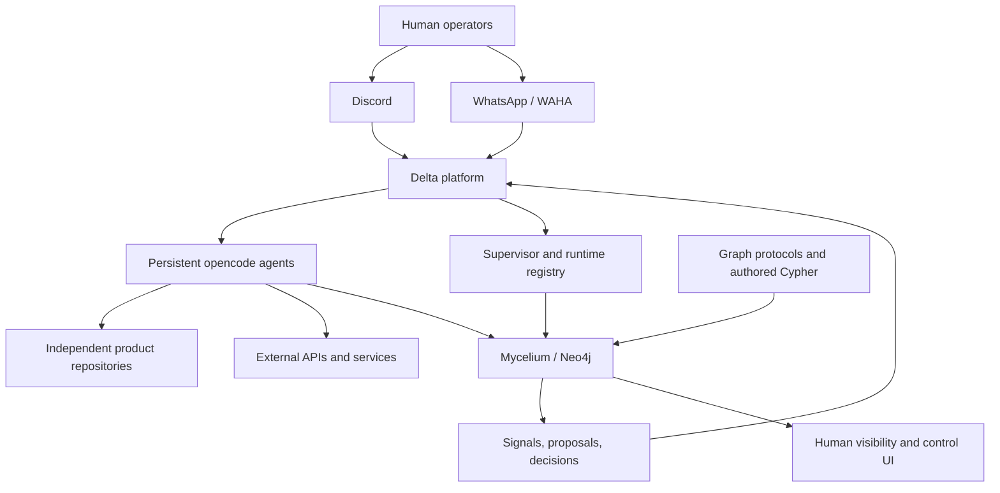
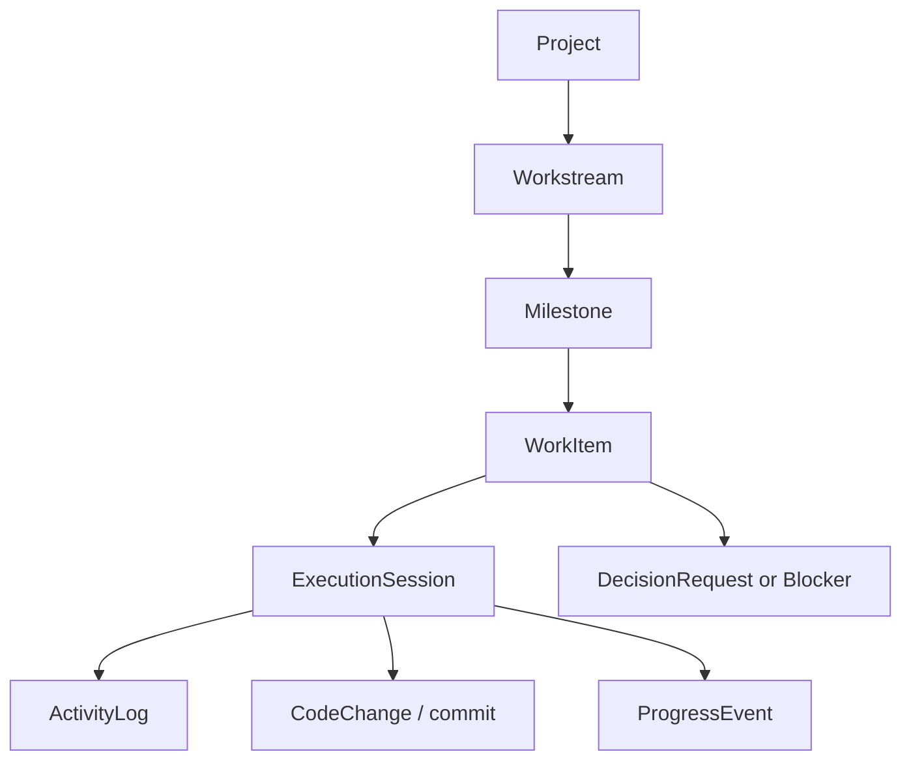

# SeedForth Platform Architecture and Migration Plan

**Status:** Proposed architecture baseline  
**Date:** 2026-09-06  
**Scope:** SeedForth platform, Mycelium, Delta, project repositories, local development, and the new production server

## 1. Purpose

This document is the execution anchor for consolidating SeedForth's platform architecture. It exists so implementation sessions do not lose the system-level direction while working on individual fixes.

The target is a clean platform with:

- one platform repository for Mycelium and Delta;
- independent repositories for product/application projects;
- Mycelium as the durable system-of-record for organization and work state;
- Delta as the transport, provisioning, scheduling, and agent-runtime layer;
- explicit synchronization between GitHub, local checkouts, server checkouts, runtime state, and Neo4j;
- architecture diagrams and operational runbooks that agree with reality.

Tetrahedron is removed from the active architecture. Its code and GitHub repository remain available as historical/reference material, but it is not part of the new platform runtime.

## 2. Target repository topology

```text
SeedForth workspace
├── seedforth/                      canonical platform repository
│   ├── architecture/               diagrams and system contracts
│   ├── mycelium/                   graph definitions, CLI, schemas, tests
│   ├── delta/                      routing, agents, provisioning, schedules
│   ├── deployment/                 server manifests and service definitions
│   ├── operations/                 backups, recovery, reconciliation
│   ├── registry/                   project and deployment manifests
│   └── integration-tests/          platform-level tests
├── flowing-indian/                 independent product repository
├── seedforthing/                   independent product repository
├── solveOS/                        independent product repository
├── ember/                          independent product repository
├── audioworld/                     independent product repository
└── tetrahedron/                    reference-only repository/checkout
```

The existing `kagrawal29/seedforth` repository becomes the canonical platform repository. Its current ignored project folders remain workspace checkouts during migration; platform source is made explicit under tracked platform directories.

Product repositories remain independent because they can have different owners, deployment lifecycles, permissions, technologies, and external clients. The platform stores their manifests and contracts; it does not absorb all application source code.

## 3. System boundaries



### Mycelium owns

- durable project, organization, agent, capability, and model identity;
- workstreams, milestones, work items, blockers, and decisions;
- graph-native protocols, invariants, and tests after promotion;
- progress, execution evidence, health, conflicts, and historical relationships;
- the durable state used by Charlie and Delta agents for grounding.

### Delta owns

- Discord and WhatsApp transport;
- project provisioning and Linux-user isolation;
- opencode process lifecycle;
- message delivery, schedules, inbox/outbox transport, and external I/O;
- observing runtime state and reporting it into Mycelium;
- executing approved low-risk proposals and control signals.

### Git owns

- source code;
- authored graph definitions;
- tests and deployment definitions;
- architecture documentation;
- review history and promotion history.

### Filesystem owns only transient or external-I/O state

- inboxes and outboxes;
- raw logs;
- downloaded attachments;
- generated runtime artifacts;
- temporary agent workspace state.

## 4. Authority and synchronization contract

"Everything synced" means every synchronization relationship is explicit and verifiable. It does not mean copying every state store into every other state store.

| Domain | Authority | Synchronization |
|---|---|---|
| Source code | GitHub repository | GitHub → local/server checkout |
| Local development | Local checkout | Developer-controlled push/PR |
| Deployed code | Server checkout + recorded SHA | GitHub → server → runtime |
| Process liveness | Supervisor | Supervisor → FleetState → Mycelium |
| Runtime configuration | Delta registry | Registry → Mycelium observation |
| Agent identity/capabilities | Mycelium | Mycelium → agent grounding/config |
| Workstreams and work items | Mycelium | Mycelium → UI/agents |
| Human decisions | Mycelium | UI/channels → Mycelium |
| Protocol definitions | Git-authored Cypher | PR → bootstrap → verified graph |
| Protocol execution | Mycelium | ProtocolRun and evidence nodes |
| Git commits/diffs | Git | Git → signals/progress → Mycelium |
| Raw conversations | Filesystem/provider | Raw log → durable graph summary |
| External provider state | Provider | Provider → observed graph state |

No reconciler may silently overwrite an authoritative source. A disagreement creates a `StateConflict`, `ActionProposal`, or equivalent visible record.

## 5. Canonical work model



- **Project:** durable business or platform scope.
- **Workstream:** strategic lane owned by a division or agent.
- **Milestone:** measurable outcome.
- **WorkItem:** one bounded unit of execution.
- **ExecutionSession:** one attempt by an agent to execute a WorkItem.
- **ActivityLog:** detailed execution evidence.
- **ProgressEvent:** durable evidence that progress occurred.
- **CodeChange:** commit/diff reference.
- **DecisionRequest:** explicit human gate.

The UI may present WorkItems as cards, but every card must trace to a Workstream and Milestone.

## 6. Agent and control lifecycles

```text
Agent process:    provisioned → running → hibernated → stopped → archived
LLM session:      created → active → expired → closed
Execution session: proposed → claimed → running → paused/failed → completed/review
WorkItem:         todo → in_progress → in_review → done
DecisionRequest:  pending → approved/rejected/deferred
Signal:           created → claimed → acknowledged → applied → recorded
```

Persistent agents and short-lived execution sessions are separate concepts. The process owns identity, tools, permissions, and project context. The execution session owns one bounded task attempt.

Initial control signals:

- start;
- pause;
- resume;
- abort;
- retry;
- assign.

Every signal requires an issuer, target, unique ID, expiry policy, acknowledgement, result, and audit link.

## 7. Migration phases

### Phase 0 — Baseline and freeze

- Inventory local repositories, branches, SHAs, remotes, dirty state, and ownership.
- Inventory server checkouts, agents, supervisor services, registry entries, and schedules.
- Query live Neo4j for projects, agents, workstreams, decisions, protocols, health, and conflicts.
- Record the old and new server relationship.
- Rotate credentials embedded in Git remote URLs.
- Produce a dated baseline report.

**Gate:** every active component has a known location, owner, branch, commit, and runtime status.

### Phase 1 — Architecture canon

Create and maintain:

```text
architecture/
├── system-overview.md
├── repository-topology.md
├── runtime-topology.md
├── state-and-sync.md
├── agent-lifecycle.md
├── graph-model.md
├── control-and-observability.md
├── operations.md
└── decisions.md
```

Each document must identify whether it is canonical, operational, proposed, historical, or deprecated.

**Gate:** SeedForth, Delta, and Mycelium no longer describe conflicting active architectures.

### Phase 2 — Platform repository consolidation

- Create the platform repository structure.
- Move Mycelium and Delta under the platform repository without changing runtime behavior.
- Preserve Git history where practical.
- Keep product repositories independent.
- Mark old Mycelium and Delta repositories as migrated/archived after cutover.
- Keep Tetrahedron as a separate reference repository and remove it from active deployment manifests.

**Gate:** one reproducible platform checkout can build, test, and deploy the platform.

### Phase 3 — Mycelium graph contract

- Separate authored graph definitions from runtime graph state.
- Define SeedForth namespaces and schema versions.
- Define the PR → bootstrap → verify promotion path.
- Add graph export/snapshot and restore verification.
- Record the deployed platform commit and graph bootstrap version in Neo4j.
- Remove or quarantine stale Maverick-only active documentation.

**Gate:** every graph change has a source file, review path, deployment record, and verification query.

### Phase 4 — Runtime reconciliation

Build a read-only reconciler comparing:

- Git SHA;
- Delta registry;
- supervisor state;
- project checkout state;
- agent runtime state;
- Neo4j state;
- recent FleetState/FleetEvent records.

Output states:

```text
healthy | drifted | conflicting | stale | orphaned | unknown
```

Start with reports and proposals. Automated repairs are limited to derived liveness and safe metadata updates.

**Gate:** one report explains the complete state of local, GitHub, server, runtime, and graph.

### Phase 5 — Work and agent model migration

- Canonicalize Project → Workstream → Milestone → WorkItem.
- Add ownership, deliverables, success criteria, and dependency rules.
- Add ExecutionSession, ActivityLog, CodeChange, and ProgressEvent relationships.
- Define persistent agent versus execution session behavior.
- Make human decisions and blockers graph-native.

**Gate:** no active work lacks an owner, deliverable, success criteria, parent outcome, or evidence path.

### Phase 6 — Control bus and observability

- Implement graph-native Signals.
- Add acknowledgement and idempotency.
- Record execution timelines.
- Capture commits, diffs, failures, pauses, retries, and approvals.
- Connect controls to Delta without bypassing authorization or graph audit.

**Gate:** every control action has an observable acknowledgement and final result.

### Phase 7 — Human visibility surface

Build a thin UI over Mycelium:

- fleet overview;
- project/workstream board;
- waiting-on-human decisions;
- agent/process/session health;
- state conflicts;
- execution timeline;
- commit and diff review.

The UI is a projection and control surface, never a second task database.

**Gate:** UI state can be reconstructed entirely from Mycelium plus explicitly documented runtime observations.

### Phase 8 — Cutover and hardening

- Verify Discord and WhatsApp end-to-end flows.
- Verify graph backup and restore.
- Verify platform deployment from a clean checkout.
- Verify every active agent and product repository.
- Resolve critical state conflicts.
- Keep the old server as rollback until the cutover checklist passes.
- Shut down obsolete services only after evidence-based approval.

## 8. Required tests

### Repository tests

- platform checkout is reproducible;
- local/server SHA reporting is correct;
- credentials never appear in remotes or tracked files;
- product repository manifests resolve correctly.

### Graph tests

- schema and namespace invariants;
- idempotent bootstrap;
- protocol execution and ProtocolRun recording;
- backup/restore;
- no orphaned active agents or projects.

### Runtime tests

- process liveness reconciliation;
- message routing;
- agent session creation;
- progress and commit ingestion;
- decision request round-trip;
- signal acknowledgement and retry behavior.

### Cutover tests

- clean deployment from GitHub;
- agent restart recovery;
- WhatsApp/Discord delivery;
- graph freshness;
- conflict report accuracy;
- rollback procedure.

## 9. Definition of done

The consolidation is complete when:

1. Mycelium and Delta live in one documented platform repository.
2. Product repositories remain independent and are registered formally.
3. Tetrahedron is reference-only and absent from active runtime architecture.
4. Every active server process maps to a graph agent and repository manifest.
5. Every project status has a declared authority and reconciliation rule.
6. Local, GitHub, server, runtime, and graph drift is observable.
7. Workstreams, milestones, and work items have one canonical model.
8. Human decisions and immediate controls are graph-native and auditable.
9. Architecture diagrams, runbooks, and graph metadata agree with production.
10. A clean operator can understand and recover the system without relying on session memory.

## 10. Execution rule

Do not begin implementation work that expands the runtime until the baseline inventory, architecture canon, authority matrix, and migration gates are complete. Each later phase must leave behind updated diagrams, tests, graph metadata, and a session handoff that points back to this plan.
