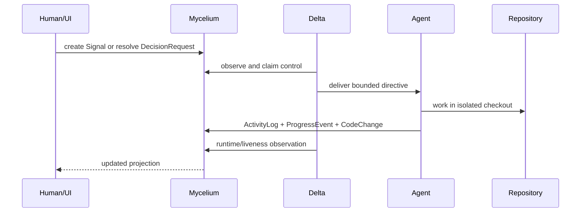

# SeedForth Runtime Topology

**Status:** Operational baseline with proposed target changes  
**Last reviewed:** 2026-09-06

## Current new-server runtime

```mermaid
flowchart TB
    Channels[Discord + WhatsApp] --> D[delta.service]
    D --> H[proj-delta-hub]
    D --> P[Project agent processes]
    P --> S[Supervisor]
    P --> Homes[/home/proj-* project homes]
    D --> Registry[delta-registry.json]
    D --> Graph[mycelium-neo4j]
    ProtocolCron[heartbeat / dream / deep schedules] --> Runner[graph-runner + external atoms]
    Runner --> Graph
    Graph --> Agents[Grounding, work, decisions, proposals]
```

The new server currently runs Delta, WAHA, Neo4j, and eight supervised opencode agents. The live graph has separate records for project agents and Flowing Indian division agents.

## Process versus session

```text
Persistent process
  owns agent identity, filesystem permissions, tools, and HTTP server

LLM session
  owns loaded context and conversation state

Execution session
  owns one bounded WorkItem attempt and its evidence
```

These must not be collapsed into one lifecycle. Stopping a process, expiring an LLM context, pausing a WorkItem, and aborting an execution are different operations.

## Proposed runtime control path



## Runtime rule

Delta may execute transport and process operations directly. Durable work-state changes must be written to Mycelium and must be auditable.
