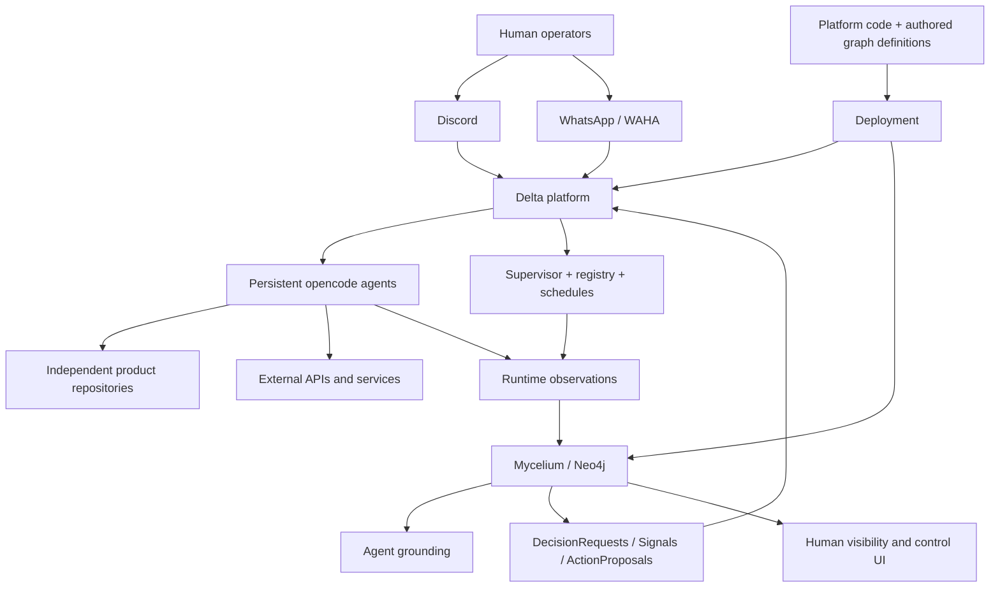

# SeedForth System Overview

**Status:** Canonical target architecture  
**Last reviewed:** 2026-09-06

## Purpose

SeedForth is an agent platform. Product repositories contain product code; the platform repository contains the machinery that routes, grounds, schedules, observes, and governs agents.



## Platform responsibilities

### Mycelium

Mycelium is the durable system-of-record for identity, organization, capabilities, work, decisions, protocols, progress, health, conflicts, and execution evidence. Neo4j is the runtime graph. Git-authored Cypher is the reviewed input to that runtime graph.

### Delta

Delta is the execution and transport boundary. It owns channel routing, provisioning, Linux-user isolation, opencode process lifecycle, schedules, inbox/outbox delivery, and external I/O. It reports observations to Mycelium and executes authorized controls from Mycelium.

### Product repositories

Product repositories own application source, product tests, product deployment, and product-specific documentation. The platform references them through project manifests and graph relationships.

### Tetrahedron

Tetrahedron is not part of the active target architecture. Its repository and code remain available as historical/reference material. No new runtime dependency should be added to it.

## Durable state versus transport state

```text
Durable:   Mycelium graph, Git history, decisions, progress, protocol definitions
Runtime:   supervisor state, Delta registry, deployed SHA, agent processes
Transient: inboxes, outboxes, raw logs, attachments, temporary workspaces
```

Transient state may be summarized into Mycelium, but it must not become an undocumented second source of truth.
